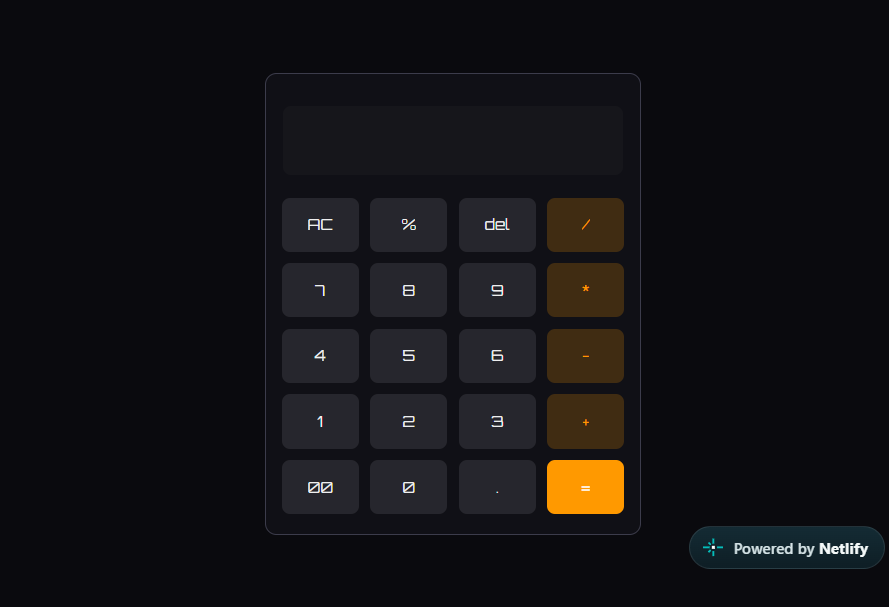

# 🧮 Calculator Web App

A custom-styled calculator built with **HTML, CSS, and JavaScript**, featuring keyboard support and handling for unusual or invalid mathematical expressions.

## 🚀 Live Demo

**[Open Calculator](https://mycalculator8899.netlify.app/)**

## 📸 Preview



## ✨ Features

* **Custom UI** — A personalized calculator interface with custom button styling.
* **Keyboard Support** — Perform calculations using your keyboard as well as the calculator buttons.
* **Expression Handling** — Handles unusual and invalid inputs, including expressions such as `abcd`, `0/0`, `9/0`, `6++`, and `7/*`.
* **Edge Cases** — Designed to handle unexpected input rather than only straightforward arithmetic expressions.

## 🛠️ Tech Stack

* **HTML5** — Calculator structure.
* **CSS3** — Styling and visual design.
* **JavaScript** — Calculator logic, keyboard interactions, and expression handling.

## 💻 Run Locally

Follow these steps to run the project on your computer.

1. **Clone the repository**

   ```bash
   git clone https://github.com/abhishekbyte-cloud/Calculator.git
   ```

2. **Navigate to the project folder**

   ```bash
   cd Calculator
   ```

3. **Open the app**

   Open `index.html` in your browser.

   Alternatively, use the Live Server extension in Visual Studio Code if you have it installed.

## 📂 Project Structure

```text
Calculator/
├── index.html
├── styles.css
├── main.js
```

*Note: Update the file names above if your actual project structure is different.*

## 🎯 Project Goal

This project is a hands-on exercise in frontend development, focusing on building a calculator interface, implementing keyboard interactions, and handling unusual user inputs.

## 👨‍💻 Author

**Abhishek Kumar**

---

If you find this project interesting, feel free to explore the code and try the live demo!
